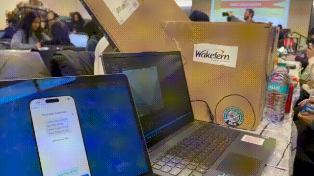
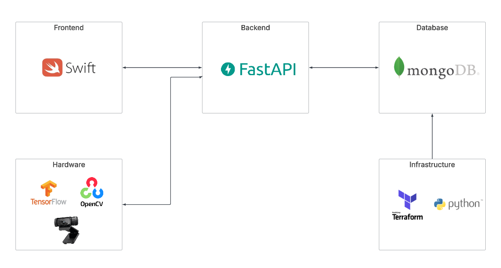

# NutriCart

## Overview  
NutriCart is a smart cart system that tracks not only prices but also macronutrient and calorie values, helping shoppers manage their nutrition in real-time. By promoting healthier eating habits and making nutritional information more accessible, it empowers individuals to make better dietary choices, ultimately contributing to public health. 

While this technology can be adapted for hot food bars like those in Whole Foods, our current implementation focuses on enhancing the shopping cart experience.

This project consists of multiple repos:

- **[Backend](https://github.com/nb923/NutriCart-Backend)**: FastAPI repo that communicates with MongoDB database and two clients.
- **[Frontend](https://github.com/Vorajay2005/NutriCart-Frontend)**: Smart cart interface built using Swift.
- **[Infra + DB](https://github.com/nb923/NutriCart-Terraform)**: Terraform and Python scripts to setup MongoDB Atlas.
- **[Hardware Device](https://github.com/Kahan-2410/NutriCart-Hardware)**: Computer vision logic for detecting items in cart.

## Architecture  

Check the [Architecture Guide](docs/architecture-guide.md) for further details on the project architecture.

## Setup Guide  
Check the [Setup Guide](docs/setup-guide.md) for instructions on making the project.
